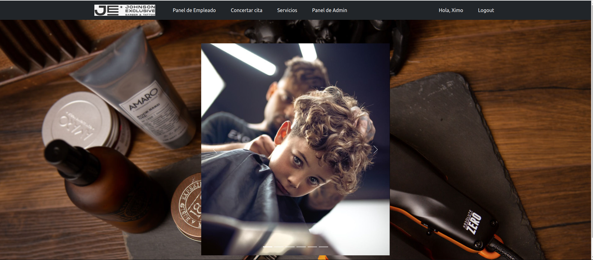

GeeksHubs Academy, Proyecto Final:
# Frontend - Peluqueria

## Tecnologías utilizadas
            

## Índice

- [Objetivo 🎯](#objetivo)
- [Vistas 🖥️](#vistas)
- [Desarrollo 🔧](#desarrollo)
- [Credenciales 🔐](#credenciales)
- [Repositorio 💾](#repositorio)
- [Instalación en Local 💽](#instalacion)
- [Agradecimientos 👏](#agradecimientos)
- [Estado 🚧](#agradecimientos)### 🚧🚧En desarollo🚧🚧

###  Objetivo 🎯
 
El objetivo de este proyecto es crear un frontend para el backend que he creado también. Se basa en la web de una peluqueria en la que puedas Registrarte, Logearte, ver tu Perfil y poder Modificarlo, ver tus citas y poder Cancelarlas, ver los Servicios disponibles, ver todas las citas existentes y poder modificarlas como Empleado o Admin y ver todos los usuarios Registrados.

Para alcanzar el objetivo he creado el Mvp (mínimo producto viable) para poder entregarlo a tiempo y poder seguir trabajando en su desarollo.

### Vistas 🖥️
#### Login:

#### Register:

#### Home: (en desarollo 🚧)

#### Panel Usuario (perfil usuario):

#### Pedir cita:

#### Panel Empleado (todas las citas):

#### Panel Admin (todos los usuarios):

#### Servicios:

### Desarrollo 🔧

La API ha sido desarrollada por Joaquin Ruiz Padrós como proyecto final de la formación Full Stack Developer de GeeksHubs. 

Para la realización del proyecto, se han utilizado el siguiente stack tecnologico:

Se ha utilizado Vite-React-JS como base del proyecto y estructura básica para conseguir una SPA funcional.

Para la gestión de información entre los diferentes componentes de la APP se ha implementado REDUX. En este caso, el uso de REDUX se ha limitado a las credenciales del usuario ya que no se ha sido necesario implementarlo en el resto de vistas/componentes.

REDUX-PERSIST y REDUX-THUNK se han añadido como librerias adicionales para la conservación de las credenciales de la página a pesar del cierre de la pestaña o ventana del navegador.

En cuanto al diseño, se han utilizado componentes de Bootstrap y MDB-Bootstrap para conseguir un diseño atractivo y responsive.

Para levantar el backend se usa docker en los puertos 3006 y 3007. Una vez levantado el contenedor del docker se puede levantar el servidor del backend y ya se podria usar todas las funcionalidades del frontend con las consultas a la BD.

Por último, como herramientas utilitarias hemos usado JWC_DECODED para desencriptar los datos del token recibido por el backend e importar las credenciales correspondientes.

### Credenciales 🔐

Para poder comprobar el funcionamiento puedes logearte como Admin, Empleado y Usuario:

# Admin:
#### Email => ximo@mail.com
#### Contraseña => admin123

###### Logeandote como Admin puedes acceder a todas las vistas, al panel de Admin donde puedes ver todos los usuarios registrados y eliminarlos, al panel de Empleado, donde se muestran todas las citas existentes y puedes modificarlas o modificar el estado de la cita a Pendiente, Cancelada o Realizada y a al panel Usuario donde muestra los datos del perfil de ususario y puedes ver tus propias citas, además de tener la opción de modificar el perfil de Usuario.
-----------------------------------------------------

# Empleado:
#### Email => johnson@mail.com
#### Contraseña =>admin123

###### Logeandote como empleado puedes acceder al panel de Empleado, donde se muestran todas las citas existentes y puedes modificarlas o modificar el estado de la cita a Pendiente, Cancelada o Realizada y a al panel Usuario donde muestra los datos del perfil de ususario y puedes ver tus propias citas, además de tener la opción de modificar el perfil de Usuario.
-----------------------------------------------------

# Usuario:
#### Email => eric@mail.com
#### Contraseña => admin123

###### Como usuario tienes limitadas las vistas al Home, Concertar una cita, Panel de Usuario y Servicios.
######Puedes Registar tantos usuarios como quieras siendo el email unico, es decir, solo puedes registrar un email una vez al igual que el Teléfono.
-----------------------------------------------------

### Instalación en local

#### Seguiremos los siguientes pasos:

###### Clonamos el repositorio $git clone 'url-repository'
###### Instalamos las dependencias $ npm install
###### Conectamos nuestro repositorio con la base de datos $ npx sequelize db:create
###### Ejecutamos las migraciones $ npx sequelize db:migrate
###### Ejecutamos los seeders $ npx sequelize db:seed:all
###### Conectamos el servidor$ npm run dev

#### En cuanto al frontend los pasos serán los siguientes:

###### Clonar el repositorio
###### $ npm install
###### $ npm run dev

###  Repositorio en GitHub 💾

Frontend: https://github.com/xIMet3/frontendPeluqueria
Backend: https://github.com/xIMet3/backendPeluqueria

### Agradecimientos 👏
Gracias a todos los compañeros que me han ayudado en especial a Jesus y Edu que me han apoyado desde el minuto uno.

### Estado:
### 🚧🚧En desarollo🚧🚧
